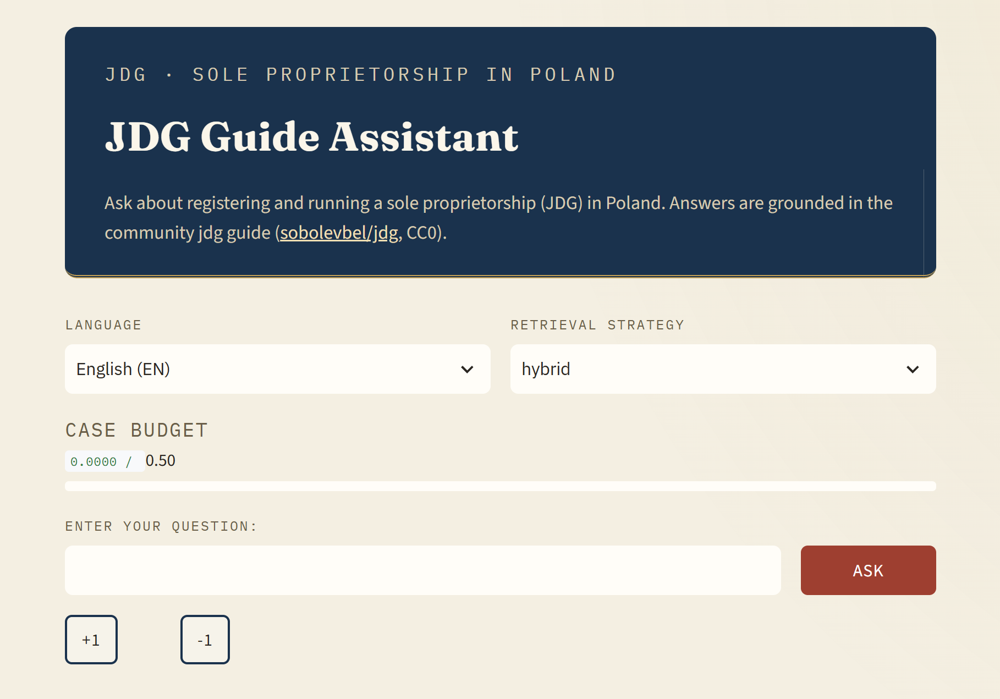
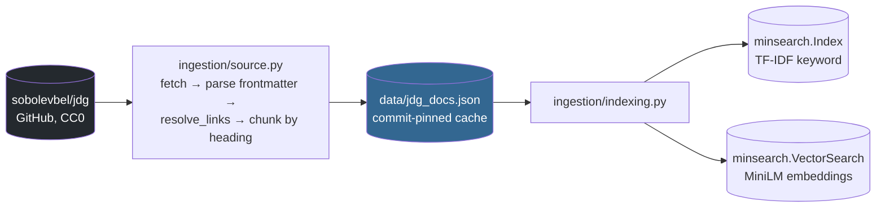
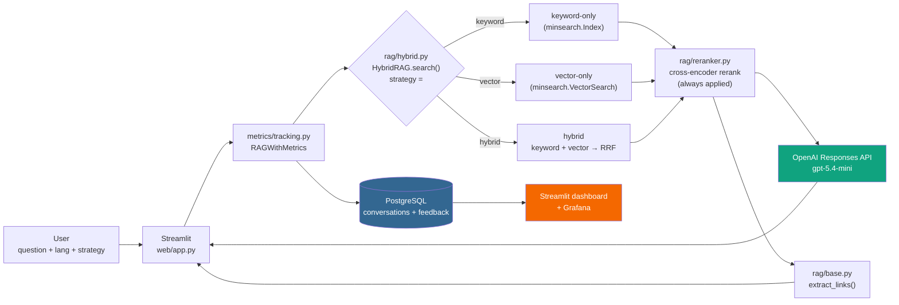
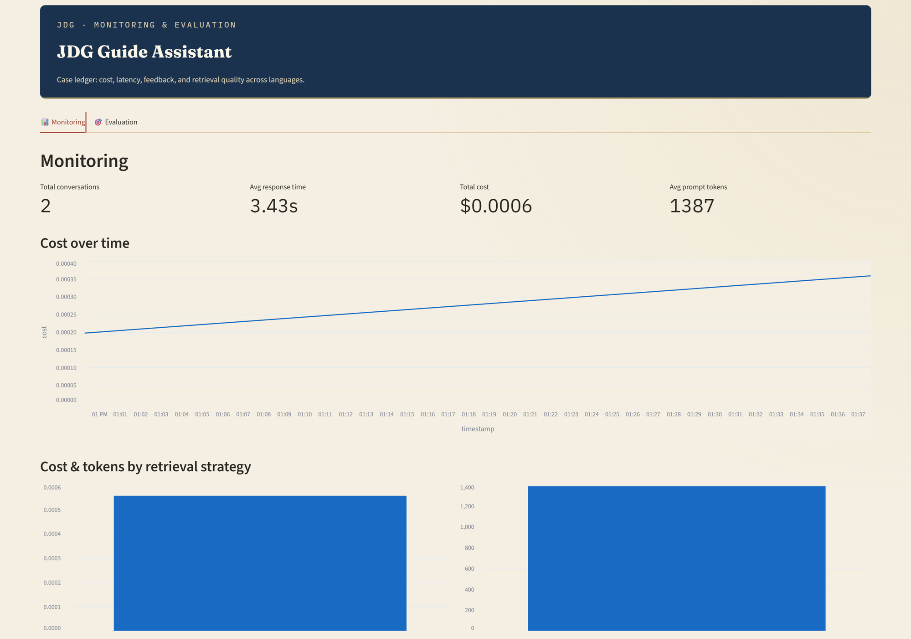
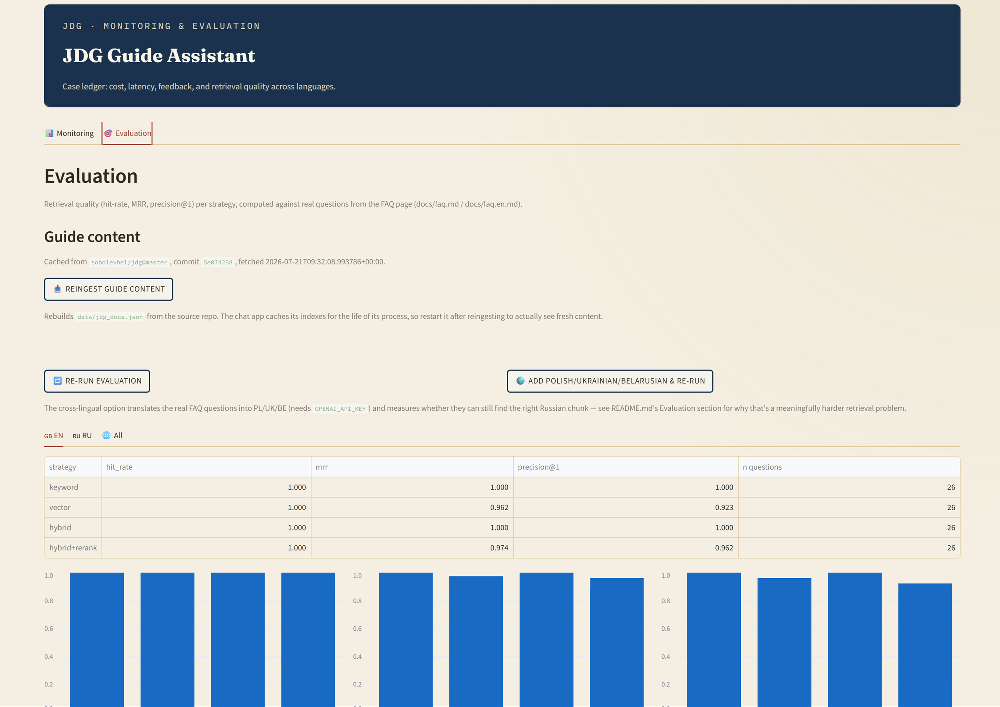
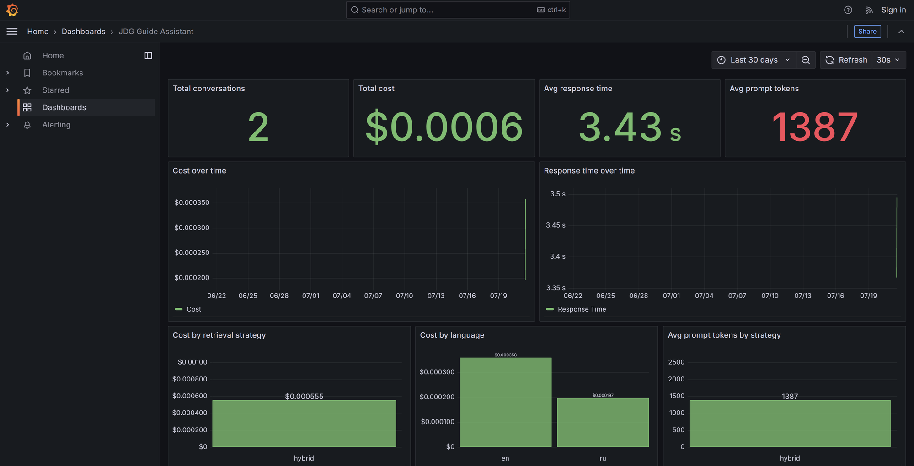

# JDG Guide Assistant
## A bilingual RAG assistant for Polish sole-proprietorship bureaucracy

A chatbot that answers questions about setting up and running a *jednoosobowa
działalność gospodarcza* (JDG, sole proprietorship) in Poland as a foreign
national — in Russian or English — grounded in a real community-written guide,
not model guesswork.

Built as a capstone project for the [LLM Zoomcamp](https://github.com/DataTalksClub/llm-zoomcamp)
course, 2026 cohort.



For a fully hand-held, zero-programming-background setup guide, see
[howto.md](howto.md). This document is the technical write-up: architecture,
evaluation, and what actually went wrong while building it.

## Problem

[`sobolevbel/jdg`](https://github.com/sobolevbel/jdg) is a dense, cross-referenced
guide to JDG bureaucracy — PESEL, Profil Zaufany, multiple ZUS social-insurance
regimes, tax declarations, residence-permit legalization, accounting-tool
walkthroughs — spread across ~40 bilingual Markdown pages. Two problems with
just searching it directly:

1. You need to already know the jargon (`ZUS ZUA`, `Ulga na Start`, `JPK_V7M`)
   to find the right page, which is exactly what a newcomer doesn't have.
2. The guide is heavy on cross-references — footnote-style Markdown links
   (`[text][1]`, with the `[1]: url` definition sitting at the bottom of the
   page). Pull a single answer out of its page into a RAG chunk, and that
   definition doesn't travel with it: the link text survives, the URL doesn't.
   (This bit back for real — see [Difficulties](#difficulties).)

## Quickstart

Prerequisites: Docker (+ Compose) and an [OpenAI API key](https://platform.openai.com/api-keys).

```bash
cp .env.example .env   # add your OPENAI_API_KEY
docker compose up --build
```

| | |
|---|---|
| Chat app | http://localhost:8501 |
| Monitoring + Evaluation dashboard | http://localhost:8502 |
| Grafana | http://localhost:3000 (no login needed to view; `admin` / `admin` or your `GF_ADMIN_PASSWORD` to edit) |

If `data/*.json` (the ingested guide, ground truth, eval results) already
exists on your machine when you build, it's baked straight into the image
for a fast first start; otherwise the first run downloads and embeds the
guide (~948 chunks), which takes a couple of minutes.

### Running it from source (for development)

```bash
cp .env.example .env   # fill in OPENAI_API_KEY

uv sync                          # editable-installs jdg_assistant from src/
uv run python scripts/ingest.py  # fetch + cache the guide (data/jdg_docs.json)

docker compose up postgres -d
uv run python scripts/init_db.py # create tables

make chat                        # Streamlit chat app, port 8501
make dashboard                   # monitoring dashboard, port 8502
```

## Usage

Ask a question in English, Russian, Polish, Ukrainian, or Belarusian (English
is the default), pick a retrieval strategy (`keyword` / `vector` / `hybrid`),
get an answer plus a **"Related links"** section. Those links are extracted
straight from the retrieved chunks in code (`rag/base.py::extract_links`),
not left to the LLM to reproduce faithfully — see Difficulties for why that
distinction mattered. Rate the answer 👍/👎; both that and an automatic
LLM-judge relevance score get logged, shown as a stamped verdict badge
(`web/styling.py`) rather than plain text.

The visual identity (`web/styling.py`, `.streamlit/config.toml`) leans into
the subject: a navy "letterhead" band, `Fraunces`/`IBM Plex` type, and the
judge verdict rendered as a rotated ink-stamp badge -- an assistant for
official paperwork should look like it belongs on official paperwork.

## Architecture

**Ingestion** — a one-time (cached, commit-pinned) pipeline that turns the
guide into two searchable indexes:



**Runtime query** — user picks a retrieval strategy per question; generation
and logging are the same regardless of which one:



## Tools used

Every entry below is an actual `pyproject.toml` dependency or a piece of
infrastructure in `docker-compose.yaml` — nothing aspirational.

| | |
|---|---|
| **minsearch** | `Index` (TF-IDF keyword search) + `VectorSearch` (cosine-similarity vector search), both in-memory |
| **sentence-transformers** | `all-MiniLM-L6-v2` for embeddings, `CrossEncoder("ms-marco-MiniLM-L-6-v2")` for reranking |
| **openai** (Responses API) | `gpt-5.4-mini` — the assistant's answers, the LLM-judge verdicts, and LLM-generated ground-truth questions |
| **pydantic** | structured LLM outputs: `RelevanceVerdict` (judge) and `GeneratedQuestion` (ground truth), parsed via `client.responses.parse` |
| **psycopg** (`psycopg[binary]`) | PostgreSQL driver for `conversations` + `feedback` logging |
| **pandas** | dataframes behind the Streamlit dashboard's tables and charts |
| **streamlit** | the chat app (`web/app.py`) and the monitoring/evaluation dashboard (`web/dashboard.py`) |
| **requests** | fetches pages and commit info from the GitHub API / raw.githubusercontent.com during ingestion |
| **PyYAML** | parses each page's YAML frontmatter (title, description, tags) |
| **python-dotenv** | loads `.env` (`JDG_REPO`, `POSTGRES_*`, `OPENAI_API_KEY`, ...) |
| **tqdm** | progress bars for embedding the corpus and generating ground-truth questions |
| **Grafana** | second monitoring view, fully provisioned from files (no manual setup) |
| **Docker Compose** | the whole stack: Postgres (with healthcheck), one-shot `init-db`, chat, dashboard, Grafana |
| **uv** | dependency management and the `src/` layout package build (via `hatchling`) |

No paid embedding API and no separate vector database: `minsearch.VectorSearch`
does in-memory cosine similarity over locally computed MiniLM embeddings, at
zero marginal cost per query.

## Evaluation

Ground truth: **52 real questions from the FAQ page itself**
(`docs/faq.md` / `docs/faq.en.md`, 26 RU / 26 EN), extracted deterministically
— each FAQ entry is already phrased as a real user question and the ingestion
chunker already splits the FAQ page one-chunk-per-question, so no LLM
synthesis or cost was needed (`scripts/build_faq_ground_truth.py`). Metrics:
hit-rate, MRR, and precision@1, all over the top-5 results
(`evaluation/retrieval_metrics.py`).

| strategy | lang | hit-rate | MRR | precision@1 |
|---|---|---|---|---|
| keyword | RU | 1.000 | 1.000 | 1.000 |
| keyword | EN | 1.000 | 1.000 | 1.000 |
| vector | RU | **0.462** | 0.394 | 0.346 |
| vector | EN | 1.000 | 0.962 | 0.923 |
| hybrid | RU | 1.000 | 0.846 | 0.731 |
| hybrid | EN | 1.000 | 1.000 | 1.000 |
| hybrid+rerank | RU | 0.885 | 0.785 | 0.731 |
| hybrid+rerank | EN | 1.000 | 0.974 | 0.962 |

Two things the split-by-language view actually caught, that an aggregate
number would have hidden:

1. **Vector-only search is much weaker on Russian** (46.2% hit-rate vs 100% on
   English). `all-MiniLM-L6-v2` is an English-centric embedding model — its
   Russian semantic matching is meaningfully worse. On this RU-primary corpus,
   vector-only would be a bad default.
2. **The cross-encoder reranker slightly hurts RU** results versus plain
   hybrid (88.5% vs 100% hit-rate). `ms-marco-MiniLM-L-6-v2` is also
   English-trained, so its Russian relevance judgments are less reliable and
   can push the correct chunk out of the top-5.

Both are reasons the app defaults to `hybrid` (keyword + vector, fused with
Reciprocal Rank Fusion, no forced reranking) rather than either extreme.
Re-run the evaluation with `make ground-truth-faq && make eval-retrieval`, or
click **"Run evaluation" / "Re-run evaluation"** on the dashboard's Evaluation
tab (`evaluation/pipeline.py` -- same code either way, just triggered from the
UI instead of the terminal; expect a couple of minutes, it embeds the corpus
and runs the cross-encoder reranker).

### Cross-lingual questions (Polish / Ukrainian / Belarusian)

The chat app also accepts questions in Polish, Ukrainian, and Belarusian
(`web/app.py`'s language selector) -- but the guide itself is only written in
Russian and English, so these aren't same-language lookups like RU/EN are.
`rag/base.py::CONTENT_LANGS` marks which languages the corpus actually has
indexed content in; for any other language, `HybridRAG.search()`
(`rag/hybrid.py`) skips the `lang` filter entirely and searches across the
full RU+EN corpus instead of filtering to an empty set (which is what used to
happen -- a Polish query against a `lang="pl"` filter always returned zero
results, since no chunk has `lang="pl"`). This is genuinely cross-lingual
retrieval: a Polish/Ukrainian/Belarusian question has to match a Russian or
English chunk on meaning (or shared vocabulary -- many bureaucratic terms
like `ZUS`, `JDG`, `PESEL`, `CEIDG` already appear verbatim in the RU/EN
text, which is enough for keyword search to partially bridge the gap even
without semantic understanding).

To measure it: `scripts/build_crosslingual_ground_truth.py` translates the 26
real Russian FAQ questions into Polish, Ukrainian, and Belarusian via LLM
(same `doc_id` target as the Russian original -- translation doesn't change
which chunk is "correct"), extending `data/ground_truth_faq.json`;
`evaluate_retrieval_by_lang` (`evaluation/retrieval_metrics.py`) picks up
whatever languages are present automatically. Needs `OPENAI_API_KEY`:

```bash
make ground-truth-crosslingual && make eval-retrieval
```

or the dashboard Evaluation tab's **"🌍 Add Polish/Ukrainian/Belarusian &
re-run"** button. Results land in the same
`data/retrieval_eval_results.json` and appear as additional language tabs
automatically -- no numbers are reproduced here since generating them needs
an API key this write-up doesn't have; run it and the dashboard fills in.

**Expectation, given the RU numbers above**: cross-lingual retrieval
(PL/UK/BE → RU) should score *below* the RU baseline, not above it -- it's
strictly a harder version of the same English-centric-embedding weakness
that already measurably hurts RU. See the improvement ideas below.

### Ideas to improve the evaluation (not yet implemented)

- **Swap to a multilingual embedding model** (e.g.
  `intfloat/multilingual-e5-small` or
  `paraphrase-multilingual-MiniLM-L12-v2`) for the vector index -- the
  highest-leverage fix for both the existing RU weakness and cross-lingual
  PL/UK/BE retrieval. The cross-encoder reranker is also English-centric and
  would benefit from the same swap.
- **Report metrics with confidence intervals**, not point estimates -- 26
  questions per language is a small sample; a bootstrap CI (paired over
  questions) would show whether a gap like "46% vs 100%" is a real effect or
  sampling noise.
- **Track answer-language correctness** as its own metric, separate from
  retrieval hit-rate: does the model actually answer in the language the
  question was asked in? For PL/UK/BE this is a real risk, since every chunk
  it's grounding on is Russian or English.
- **Separate "cross-lingual" from "same-language" as an explicit dimension**
  in the metrics table, not just a `lang` column -- averaging RU/EN
  (same-language) together with PL/UK/BE (cross-lingual) would hide exactly
  the effect this feature is meant to surface.

## Monitoring

Every call to the assistant logs one row to `conversations`
(`persistence/conversations.py`): question, answer, `lang`, `strategy`, model,
prompt/completion/total tokens, cost, response time, timestamp. Thumbs
up/down and the LLM-judge relevance verdict log to a linked `feedback` table.

The Streamlit dashboard (`web/dashboard.py`, port 8502) has two tabs:
**Monitoring** (cost over time, cost/tokens by strategy and by language, judge
relevance, user feedback) and **Evaluation** (the retrieval table above, with
per-language sub-tabs, read from `data/retrieval_eval_results.json`). The
Evaluation tab also has a **"📥 Reingest guide content"** button (shows the
cached commit/fetch time, then rebuilds `data/jdg_docs.json` from the source
repo) and **"🔁 Re-run evaluation"** / **"🌍 Add Polish/Ukrainian/Belarusian &
re-run"** buttons that regenerate `data/ground_truth_faq.json` and
`data/retrieval_eval_results.json` -- the same actions as the `make` targets
below, triggered from the UI instead of the terminal. Note: the chat app's
indexes are cached for the life of its process, so it needs a restart to
pick up a reingest.





Grafana (port 3000) is fully provisioned from `grafana/` — a Postgres
datasource and a 13-panel dashboard both load automatically from files, so a
fresh `docker compose up` on a new machine has working dashboards immediately,
no manual "add datasource" click-through.



## Difficulties

The debugging stories that actually shaped the code:

**Reference-style links don't survive being chunked.** The guide writes links
as `[text][1]`, with `[1]: some/page.md` sitting in a block at the very bottom
of the page — standard Markdown, invisible to a human reading the rendered
site. Chunking by heading pulls `[text][1]` into its chunk but leaves the `[1]:
...` definition behind in a different (or discarded) chunk, so a retrieved
excerpt could contain a link with no resolvable target. Fixed by resolving
every reference-style and relative link to an absolute URL
(`https://sobolevbel.github.io/jdg/...`) during ingestion, *before* chunking,
so each chunk is self-contained (`ingestion/source.py::resolve_links`).

**Correct retrieval, wrong answer.** For the exact FAQ question "Можно ли
податься на BlueCard как JDG" ("Can I apply for a Blue Card as a JDG?"), the
assistant answered "Не знаю" (I don't know) — even though the correct chunk,
containing a clear "**НЕТ**" and its explanation, verifiably ranked #1 across
keyword, vector, *and* hybrid+rerank retrieval when tested directly against
the live index. The failure was on the generation side: the model hedged into
refusal despite having the answer in context. Mitigated (not guaranteed fixed
— this is LLM behavior, not a deterministic bug) by rewriting the system
instructions to explicitly check each excerpt's heading against the question
before concluding "not found". The same investigation is why link display was
made deterministic in code (`extract_links`) rather than trusted to the model:
if the model can hedge on answering, it can just as easily drop a link it
judges "not essential".

**A host `.venv/` silently broke every Docker rebuild.** `uv sync` run locally
(to ingest data / test outside Docker) created `JDG-Guide-assistant/.venv/`. With no
`.dockerignore`, the Dockerfile's `COPY . .` — which runs *after*
`RUN uv sync` builds the container's own venv — copied that host `.venv/`
straight into the image, overwriting the correctly built one and producing
`ModuleNotFoundError: No module named 'jdg_assistant'`. This survived
`docker compose build --no-cache`, because the bug was in the build *context*
being sent to Docker, not in layer caching — no amount of cache-busting fixes
a bad `COPY . .`. Fixed with a `.dockerignore` excluding `.venv/`,
`__pycache__/`, `.git/`, and the local data caches.

**A Docker Compose DNS race on `postgres`.** `init-db` (a one-shot container
that runs `CREATE TABLE IF NOT EXISTS`) occasionally failed with
`psycopg.OperationalError: failed to resolve host 'postgres'` right after the
`postgres` service was marked healthy — a transient race in Docker's embedded
DNS resolver, not an actual outage. Fixed with retry-with-backoff around the
connection itself (`persistence/db.py::get_db_connection`) plus
`restart: on-failure:5` on the `init-db` service as a second line of defense.

## Project structure

```text
src/jdg_assistant/
  ingestion/    source.py (fetch/parse/chunk/resolve_links), indexing.py (keyword + vector index)
  rag/          base.py (RAGBase, RRF, extract_links), hybrid.py (HybridRAG), reranker.py (cross-encoder)
  metrics/      cost.py (rate table, LLMCallRecord), tracking.py (RAGWithMetrics)
  persistence/  db.py (connection, schema), conversations.py, feedback.py
  evaluation/   llm_utils.py, retrieval_metrics.py (hit-rate/MRR/precision@1), judge.py, ground_truth.py
  web/          app.py (chat), dashboard.py (Monitoring + Evaluation tabs)
  assistant.py  composition root: create_assistant() wires the above together
scripts/
  ingest.py, init_db.py, run_assistant.py, generate_data.py,
  build_faq_ground_truth.py, generate_ground_truth.py, eval_retrieval.py, check_freshness.py
grafana/
  provisioning/  auto-registers the Postgres datasource and the dashboard file provider
  dashboards/    jdg_assistant.json (13 panels)
```

## Dataset

[`sobolevbel/jdg`](https://github.com/sobolevbel/jdg) — community-maintained,
**CC0-1.0** (public domain). 38 pages, fully bilingual (76 files, RU + EN),
~948 chunks after heading-scoped ingestion. `data/jdg_docs.json` caches the
ingested content alongside the commit SHA it was built from;
`scripts/check_freshness.py` compares that against the latest commit on
`JDG_REPO`@`JDG_BRANCH` (both configurable via `.env`) and proposes a reingest
when they diverge.

```bash
make check-freshness   # uv run python scripts/check_freshness.py
make reingest           # uv run python scripts/ingest.py --force
```

## Limitations

- **No automated test suite.** Verification throughout development was manual
  and live — running ingestion, retrieval, and the eval script against the
  real repo and real models — not a pytest suite; there is no CI.
- **The LLM-judge scores relevance only**, not faithfulness or groundedness
  (no RAGAS-style context-precision/context-recall metrics).
- **The FAQ ground truth is small (52 questions)** and covers only the FAQ
  page, not the full ~948-chunk corpus (`scripts/generate_ground_truth.py`
  builds a larger LLM-generated set across all chunks, but it isn't what's
  wired into the dashboard).
- **Embedding and reranker models are English-centric**, measurably weaker on
  the RU side of a RU-primary corpus (see Evaluation) -- and Polish/
  Ukrainian/Belarusian questions rely on the same models to bridge to RU/EN
  content cross-lingually, so this weakness compounds there.
- **Single-turn.** No conversation memory across questions.
- **The cost budget guard is a soft, per-session Streamlit UI limit** — not
  enforced server-side, and it resets on page refresh.
- **No auth, no rate limiting.**
- **`metrics/cost.py::MODEL_RATES` is a manually maintained lookup table** —
  it silently reports $0 cost for any model not listed in it.

## Conclusions: how to improve RAG search here

The measured baseline (Evaluation section above) points at one root cause
behind every retrieval weakness this project found: `all-MiniLM-L6-v2` and
`ms-marco-MiniLM-L-6-v2` are both English-centric models asked to do
non-English and cross-lingual work. `hybrid` (keyword + vector, RRF-fused, no
forced rerank) is the best available *default* given that constraint, but
it's a workaround, not a fix. In priority order, what would actually move the
numbers:

1. **Translate the query before retrieving, not just at answer time.** The
   cheapest, most targeted fix for Polish/Ukrainian/Belarusian: an LLM call
   that translates the incoming query into Russian *before* it hits
   `HybridRAG.search()`, turning a cross-lingual lookup into the same-language
   RU lookup that already scores 100% hit-rate with `hybrid`. One small LLM
   call, no model swap, no reindexing -- likely the single highest
   value-for-effort change available.
2. **Swap to multilingual embedding/reranker models** (e.g.
   `intfloat/multilingual-e5-small` for vectors, `BAAI/bge-reranker-v2-m3` for
   reranking) -- the structural fix underneath (1). Directly addresses the
   measured RU weakness too, not just PL/UK/BE.
3. **Tune retrieval hyperparameters against the ground truth before trusting
   any of the above.** `rrf_k=60` and the `title`/`section`/`content` boost
   weights (`rag/base.py`, `rag/hybrid.py`) are untouched defaults -- nobody
   has run a sweep against `data/ground_truth_faq.json` yet. Given how much a
   parameter sweep moved a comparable project's numbers (CineVec: +16.7 points
   of hit-rate from tuning alone, per its README), there's very likely
   free performance sitting in these untuned constants.
4. **Glossary-grounded query expansion.** `docs/glossary.md` maps JDG jargon
   and abbreviations (`ZUS ZUA`, `Ulga na Start`, ...) but nothing in the
   pipeline uses it. Expanding a query with glossary-linked terms before
   search is a cheap way to help keyword search bridge both jargon gaps and
   part of the cross-lingual gap (since many of those terms are shared
   Polish/RU/EN loanwords already).
5. **A larger, statistically sound ground truth.** 26 questions per language
   is too small to safely act on any of the above without a bootstrap
   confidence interval (see the evaluation-methodology ideas above) --
   otherwise it's easy to "fix" noise.
6. **Actually index PL/UK/BE content**, not just bridge to it. The most
   robust (and most expensive) long-term option: machine-translate the corpus
   itself into Polish/Ukrainian/Belarusian at ingestion time so those
   languages get real same-language retrieval instead of a cross-lingual
   bridge, however good that bridge gets.

## Attribution

Guide content © [sobolevbel/jdg](https://github.com/sobolevbel/jdg) contributors,
[CC0-1.0](https://github.com/sobolevbel/jdg/blob/master/LICENSE) (public domain).
